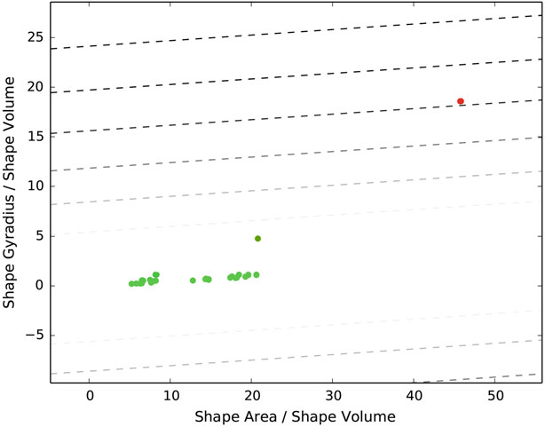
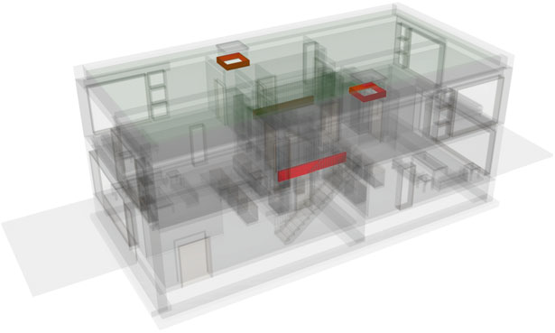

# IFC Machine Learning

Source code for https://link.springer.com/chapter/10.1007/978-3-319-24208-8_33

Based on https://github.com/DURAARK/pyIfcExtract

## Usage

    python -c "import os; os.mkdir('output')"
    python extract_geometrical_descriptors.py files\Duplex_A_20110907_optimized.ifc > output\Duplex_A_20110907_optimized.csv
    python classify_geometries.py output\Duplex_A_20110907_optimized.csv

